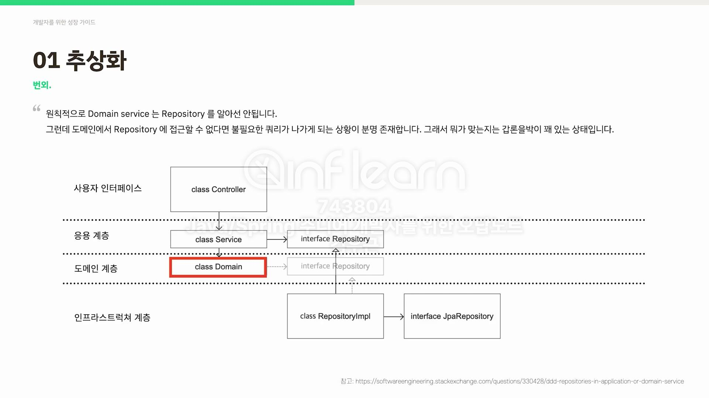

#### 트랜잭션 스크립트 패턴
- DDD적용 -> 4개의 레이어
  - controller -> application service(응용 계층) -> domain model(도메인 계층) -> repository(인프라스트럭쳐 계층)
  - 응용계층은 최대한 얇게 유지, 작업을 조정하고 아래에 위치한 계층에 도메인 객체의 협력자에게 작업을 위임한다.
  - 로직자체가 목적인 객체를 두고 도메인 서비스라 부른다. ex) PriceCalculator

#### 추상화
- 시스템 외부 연동(DB, WebClient | RestTemplate) 은 가능하면 모두 추상화.
- 
- 좋은 설계인지 확인하는 방법은 테스트 하기 쉬운 코드인가를 확인하는 방법이다.