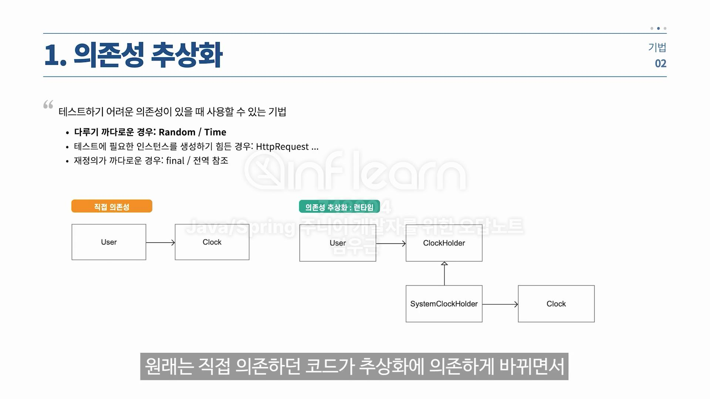
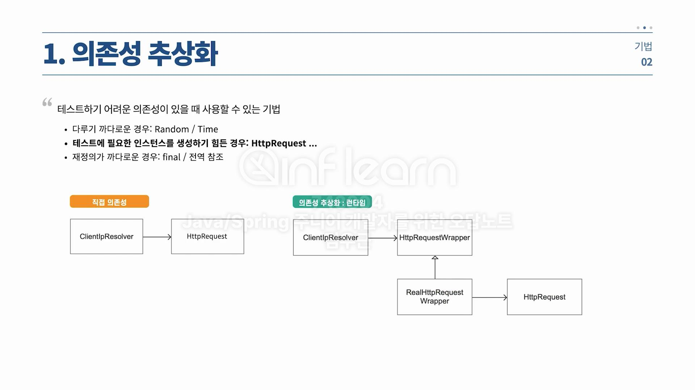

### 테스트란?
#### 레거시 코드?
- 테스트가 없는 코드
- Regression(회귀): 코드 수정 후에 갑자기 서비스가 돌아가지 않는 현상.

#### 인수/자동 테스트
- 인수 테스트
  - 체크리스트로 관리하며 테스트 항목을 사람이 하나하나 검사하는 것.
- 자동 테스트
  - 소프트웨어가 자동으로 테스트.

#### 테스트의 3분류
- E2E -> API 테스트
- INTEGRATION -> 통합 테스트
- UNIT -> 단위 테스트

- 구글 엔지니어는 이렇게 말한다.
  - E2E -> 대형 테스트
  - INTEGRATION -> 중형 테스트
  - UNIT -> 소형 테스트

#### 소형 테스트
- 단일 서버/프로세스/스레드로 동작
- 디스크 I/O 사용 X
- 네트워크 호출(외부 API 호출)과 같은 Blocking call 허용 X

#### 중형 테스트
- 멀티 프로세스/스레드
- h2 테스트 같은 테스트용 DB를 사용할 수 있다.

### 테스트에 필요한 개념
#### SUT
- System under test: 테스트 하려는 대상

#### Test Double
- Dummy : 어떤 로직도 없음
- Fake : local/test 에서 사용하기 위해 만들어진 가짜 객체, 로직은 있음.
- Stub : 외부 연동하는 컴포넌트들에 많이 사용하는 객체.

### 테스트 기법
- 
- 