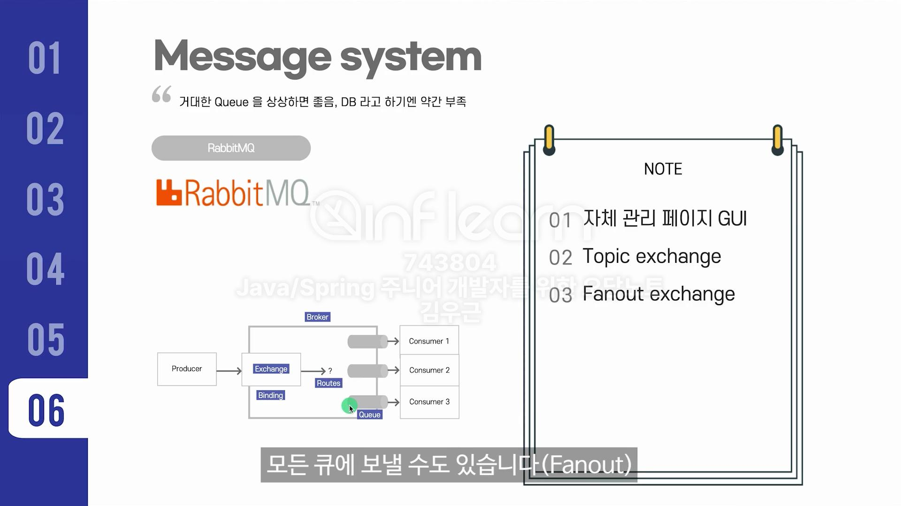
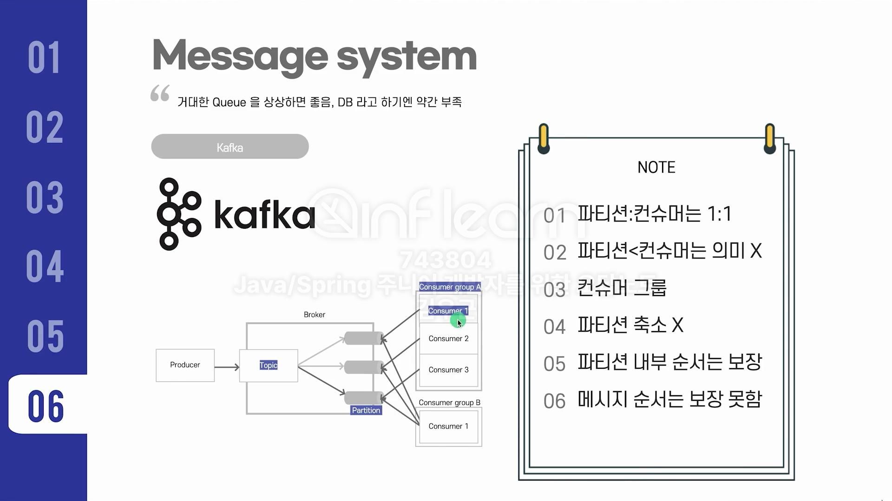

### NoSQL
#### Key-Value
- redis
  - ex) 조회수, 좋아요, 재고 숫자 표현
  - 싱글 스레드 -> 확장 전략 : 샤딩/클러스터 모드
  - Keys 사용 금지

#### Wide column DB
- 대량의 데이터를 동적인 칼럼을 갖는 테이블에 read/write 하는 DB, 데이터 압축, 분산처리에 특화
- RDB와 다르게 relation이 없어서 Write성능이 빠름.
- ex) 카산드라, HBase
  - cassandra
    - Consistent hashing: 카산드라에서 데이터를 저장하는 방식
      - 해시 함수에 돌려 나온 값을 노드별로 분산 저장.
    - Partition Key 가 중요
    - Write 성능이 매우 좋음.

#### Document DB
- 몽고DB
  - 4버전 부터 트랜잭션 지원, 전문검색 지원
- ES는 뭐 잘 아니까 pass

#### Graph DB
- 소셜 관계망, 구독 모델과 같은 follow 같은 기능 구현할 떄 많이 사용
- ex) neo4j

#### Message system
- Rabbit MQ
  - Producer가 Exchange 에다가 데이터를 publish 하면
  - Broker 가 이 데이터를 받아서 Binding 된 큐로 라우트한다.
  - 이 때, Exchange를 어떤 타입으로 사용하느냐에 따라서 
  - 데이터를 하나의 큐에만 보내는 Topic이 될수도, 모든 큐에 보내는 Fanout 방식이 될 수 있다.
  - 
- kafka
  - 토픽/파티션/컨슈머 그룹/컨슈머
  - Producer가 Topic에 데이터를 publish하면 Topic은 데이터 key값에 따라서 특정 파티션으로 데이터를 보냄
  - 이 파티션을 바라보고있는 컨슈머들이 데이터를 처리.(하나의 파티션에는 하나의 컨슈머 그룹의 하나의 컨슈머)
  - 
  - 파티션은 확장만 되고 축소 X -> 초기에 너무 큰 숫자 X

#### 개발 용어 관련
- SSO(Single sign-on)
  - 로그인 한번으로 여러 서비스를 이용할 수 있게 되어 있으면 SSO를 지원하고 있는 것.
    - ex) 네이버 페이 로그인 하면, 네이버 로그인을 사용하는 다른 서비스에서도 자연스럽게 로그인 처리가 된다? -> SSO 지원
- CORS
  - 브라우저에서 요청, PREFLIGHT Request (선발대 개념의 API, OPTION)요청
  - 서버는 Access Control Allow Origin에, '너의 도메인은 ~~여야 해' 라고 응답
- 공변성(Covariant)
  - 서브 타입이 슈퍼 타입 대신 사용될 수 있다.
- 패키지 매니저
  - 개발환경을 도와주는 '패키지 관리 도구'
  - ex) ubuntu: apt-get, centOS: yum, redhat계열: rpm, mac: brew 
- 리눅스 기본 커맨드
  - 일반적으로 커맨드에 옵션을 적을 때,
    - 한글자인 경우 -v -f -h
    - 두글자 이상인 경우 --version, --file, --human-readable
```angular2html
# CPU 전체 정보
cat /proc/cpuinfo

# CPU 코어 개수
cat /proc/cpuinfo | grep 'processor' | wc -l

# CPU 코어 모델
cat /proc/cpuinfo | grep 'model' | tail -l

# MEM 전체 정보
cat /proc/meminfo | grep 'MemTotal'

# MEM 이용 정보
free

# 하드 용량 (disk free human-readable)
df -h

# 하드 사용량 (disk usage human-readable)
du -h

# OS 정보
cat /etc/*-release | uniq

# 서버 모니터링
top

# 로그 테일링
tail -f /filename
```