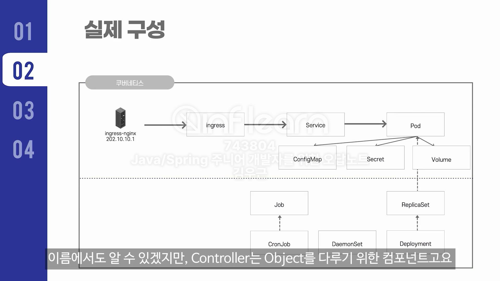

#### 운영 용어 정리
- 시스템 확장, 서비스의 트래픽이 올라간다. 어떻게 할까?
  - 관리자 -> scale-out/up
  - 아키텍처(개발자)
    - x축 확장: 백엔드 인스턴스 수 늘리기
    - y축 확장: 기능분할을 통해 트래픽 집중 처리(모놀리틱 -> MSA)
    - z축 확장: 데이터 파티셔닝(모놀리틱 | MSA 둘 다 가능)

- HA
  - 1년중 5분만 장애일 떄를 보고 `five nines`라 한다. 고품질의 수치

- 이중화 방식
  - Active-Standby: 같은 시스템을 띄우되 하나는 사용하지 않고 예비로 남겨둔다.
  - Active-Active: 같은 시스템 둘 다 사용, 두 개의 시스템 앞단에 LB를 둔다.
    - 큰 맥락에서 Master-Slave 가 이 방식에 해당

- Provisioning
  - 시스템을 즉시 사용할 수 있는 상태로 준비하는 것.
  - 서버 자원 프로비저닝, OS 프로비저닝, 스토리지 프로비저닝.. 이 있다.

- DR(disaster recovery plan)
  - 재난이 일어났을 때, 어떻게 복구할 것인가에 대한 계획
  - 시스템 이중화 이상의 '재난 대응 매뉴얼'을 작성하는 일.

- Failover 와 Switchover
  - 장애가 발생했을 때, StandBy를 사용한다고 가정
    - StandBy같은 예비 시스템으로 전환되는 것이 `**자동화**` 되어 있다면 Failover
    - 수동으로 전환(사람이 직접)하면 Switchover, 자주 접하지 않음.
- Failback
  - Failover에 따라 전환된 서버/시스템/네트워크 장애를 원상 복구 하는 것.
  - 자동보다는 수동으로 하는 것이 더 많다.

- 오픈소스
  - 스크립트 처리기: 젠킨스, GoCD, Ansible(지정한 서버들에 동일한 동작을 시킴)
  - 패스워드 관리기: Vault
    - DB접근에 사용되는 패스워드 같은 정보
  - 오픈소스 라이센스: Apache license2.0, MIT는 그냥 사용 ok

- Webhook
  - 이벤트가 발생했을 시 연쇄적으로 발생시키는 API 호출
- 기타
  - 유불 -> 유저불량
  - CS -> 고객 문의
  - TL;DR -> too long; didn`t read => 세줄 요약해주라.
  - 마일스톤 -> 1차 목표, 2차목표같이 프로젝트 중간중간.
  - ROI(return on investment) -> 투자대비 수익률(가성비) 
    - 해당 피처 개발하는데 3개월 걸린다면 ROI가 너무 안나옵니다.
  - R&R(role and responsibility) -> 역할과 책임

#### 쿠버네티스
- pod가 우리의 애플리케이션
- 
- 요청은 ingress/service/pod 순으로 온다.

- controller 와 object
- 위는 Object, 아래는 controller(Object를 다루기 위한 컴포넌트)
- 