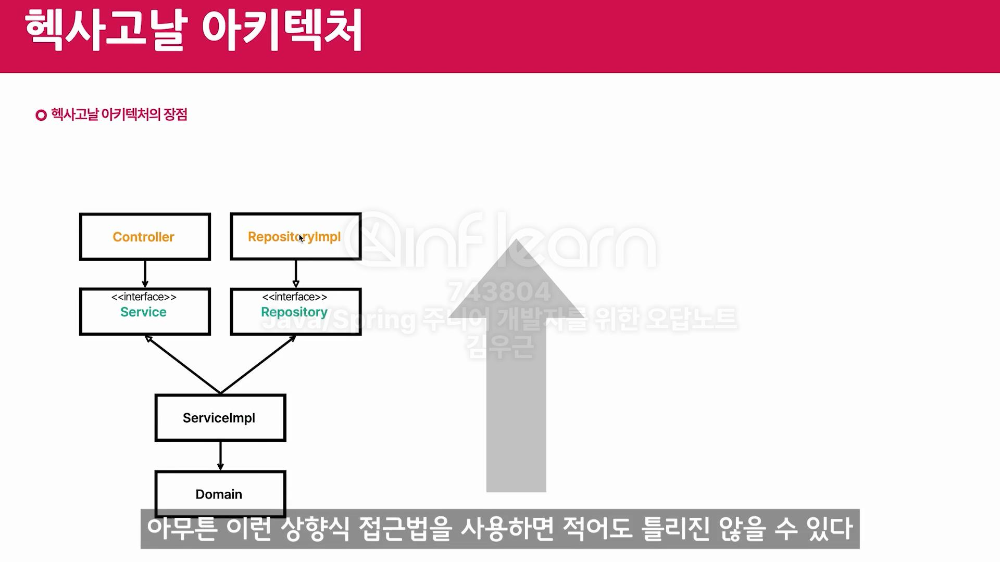

### 아키텍처
#### 레이어드
- 단점
  - 도메인이 죽는다. -> 트랜잭션 스크립트 패턴이 될 확률이 높아진다.
  - service 가 신이 된다.

- 보완
  - Service는 그냥 Repository에서 도메인을 가져오고, 도메인한테 일을 시킨다.

#### 헥사고날
- 의존성 역전은 관심사를 분리하는 기법 중 하나이다.
- 의존성 역전을 보고 '포트-어댑터' 패턴이라고도 부른다.
- 의존성 역전 으로 도메인을 고립시키는 것이 헥사고날 아키텍처이네..
  - Input 어댑터 - Input port - ServiceImpl - Ouput port - Output 어댑터
    -                             domain
- 장점
  - 도메인이 순수해져서, 상향식 접근법을 사용하면 된다.
  - 

#### 클린 아키텍처
- 헥사고날 아키텍처가 클린 아키텍처의 구현체라 생각하면 쉬움.
- 외부 세계에서 내부 세계로 향하는 방향을 단방향으로 유지해야 한다.
- 다만, 용어가 다름
  - Input port 대신 유스케이크 사용.
  - Output port 대신 Gateway 사용.
  - Input 어댑터, Output 어댑터 대신 Humble(험블)이라 부른다. 예로, DB와 GUI등이 있다.
    - 험블: 별 볼일 없다는 뜻, 이름조차 생각하지 않음.

#### 엔티티와 코드 튜닝
- 엔티티는 Jpa/DB랑 상관이 없다.
- 도메인 엔티티, DB엔티티, 영속성 객체. 이 3개의 개념을 구분하는 것이 중요.
- 도메인 엔티티
  - 소프트웨어에서 도메인/문제를 해결하기 위해 만들어진 모델.
  - 비즈니스 로직 O, 식별 가능.
- 객체지향 -> 도메인 엔티티(class)
- DB -> DB엔티티(table
- 객체지향과 DB가 협업하는 것을 도와준 것이 영속성 객체(Jpa)

#### 기타
- 맨 아래 나오는 창 -> toast
- GNB(Global Navigation Bar): 제일 상단에 뜨는 내비게이션 바
- LNB(Local Navigation Bar): GNB의 특정 메뉴를 클릭해서 나오는 서브 메뉴
- 